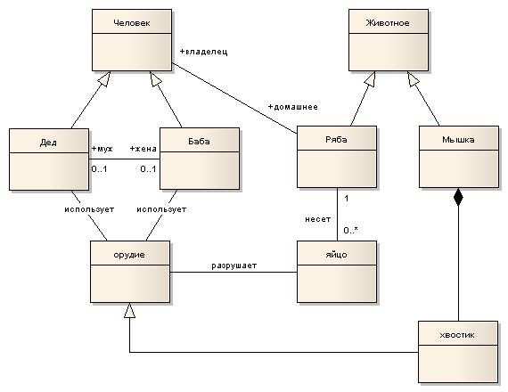
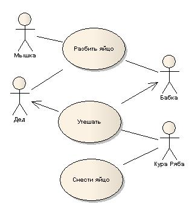
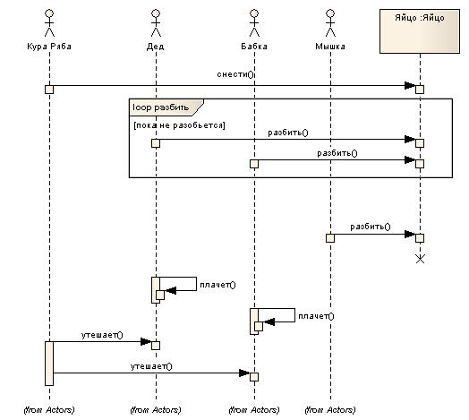

###По мотивам сказки

```
Жили-были дед и баба. Была у них курочка-ряба. 
Снесла как-то раз курочка-ряба яйцо да не простое, а золотое. 
Дед бил-бил, не разбил. Бабка била-била не разбила. 
Пробежала мышка, хвостиком махнула, яйцо упало и разбилось. 
Дед плакал-плакал, бабка плакала-плакала. 
Стала курочка утешать: "Не плачь бабка, не плачь дедка. Я вам еще снесу"
```


~~ТЗ на разбитие яйца появится в google.doc чуть позже)~~
Нет. Все гораздо проще. Извольте, [ТехническоеЗадание_ПриготовлениеЯйца.rtf](ТехническоеЗадание_ПриготовлениеЯйца.rtf)

Вы скажете:
- "А ну и что?"
- "Согласен, ничего особенного, теперь [ближе к практике](https://github.com/iruslanalexan/servicedescrestapi.git) " - отвечу я вам, ссылаясь на [реализацию задачи по интеграции с ServiceDesc](https://github.com/iruslanalexan/servicedescrestapi.git)

-------------------
*Class diagram
*Use Case
*Use case model

